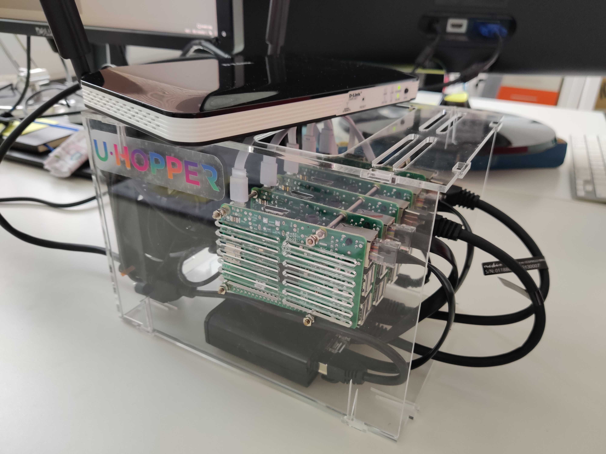
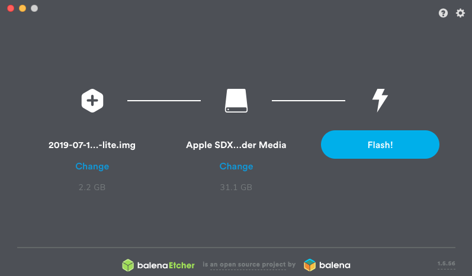
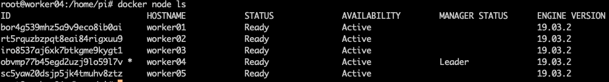

=================
Flink on a Fridge
=================

********
Overview
********

The purpose of this documentation is to explain the deployment of `Apache Flink <https://flink.apache.org/>`_ on a cluster of Raspberry Pis, which we simply call it the Fridge.
We used Docker Swarm to connect the Pis, and used Docker Stack to deploy the custom built Flink docker image for ARMv7 processor.

==========
Deployment
==========

First of all, the hardware:
 * Few Raspberry Pi devices: we used 5 of Raspberry Pi 3b
 * Each Pi requires a micro SD card to run an OS
 * A network switch
 * A router
 * Power source
 * Network cables to connect everything together

  The Fridge constructed in INRIA, later used for the deployment of the Flink stack

************************
Preparing the Pi cluster
************************

1. Install the Operating System on SD cards

Download the latest version of `Raspbian Buster Lite <https://www.raspberrypi.org/downloads/raspbian/>`_ and burn the image on SD cards using `Etcher <https://www.balena.io/etcher/>`_ .

2. Enable SSH

Create an empty file named *ssh* on the SD card to enable SSH.

.. code-block:: bash

  $touch /Volumes/boot/ssh

3. Setup the Pis

Plug the SD cards into Raspberries, SSH into it. Default host name would be *raspberrypi.local* and default password is *raspberry*.

.. code-block:: bash

  $ssh pi@raspberrypi.local

Additionally you can use tools like `Angry IP scanner <https://angryip.org/>`_ to find out the correct host names of each Pis.

Set the hostname as you prefer by editing in:

.. code-block:: bash

  $sudo raspi-config

And set the static IP address by editing */etc/dhcpcd.conf* file

.. code-block:: bash

  $interface eth0
  $static ip_address= preferred IP
  $static routers= router IP
  $static domain_name_servers= preferred DNS, or you can set it as 8.8.8.8

.. note::
  You might want to clean up some entries in *~/.ssh/known_hosts* file on your machine.

This process should be replicated on each Pis.

*********************
Creating Docker Swarm
*********************

Now we can move on to creating Docker Swarm on a Cluster.

1. Install Docker on each node:

.. code-block:: bash

  $curl -fsSL https://get.docker.com | sh

2. Create Swarm and join nodes

Initialize the Swarm cluster on one node using its IP. This node will act as a leader

.. code-block:: bash

  $sudo docker swarm init --advertise-addr 192.168.0.104

The result will print the output, also you can run the following command to see the token for the Swarm.

.. code-block:: bash

  $docker swarm join-token worker

And copy the result on other nodes to join the Swarm

.. code-block:: bash

  $docker swarm join --token SWMTKN-1-4y0h8i1aktttxxpuyk8844jk8rd1nt3k9oxdrfujg97z4va39d-0fnsq9ayei2s88xeuim7jdosz 192.168.1.104:2377

Check on the Leader node whether if the swarm is working

.. code-block:: bash

  $docker node ls

If the swarm initialization was successful, it should look like this. Now we're ready to deploy Flink.

***************************
Building custom Flink image
***************************

Short story is there's currently no native support for ARMv7 architecture for Flink Docker image.
Also, you'll have to play with some Flink configurations in order to able to run it on Raspberry Pi.

1. Play with Flink configurations

You can see all Apache Flink configurations `here <https://ci.apache.org/projects/flink/flink-docs-stable/ops/config.html>`_ and in *flink-conf.yaml* file, change the default
*jobmanager.heap.size* to *512m* and *taskmanager.heap.size* as *256m*. Those memory sizes were set considering the memory size of
Raspberry Pi device and number of task managers might be deployed in the future.

.. note::
  Additionally, you might want to change *TM_MAX_OFFHEAP_SIZE="1G"* in *taskmanager.sh* file

**********************************
Deploying Flink image on a Cluster
**********************************

Lorem ipsum dolor sit amet, consectetur adipiscing elit. Nunc vel augue finibus, porta lorem in, congue metus.
Curabitur sodales mi sodales, fermentum nulla at, pellentesque urna. Nunc porta iaculis nibh vitae convallis.
Phasellus rhoncus ipsum vel nulla elementum, non egestas velit euismod

**********
Next steps
**********

Lorem ipsum dolor sit amet, consectetur adipiscing elit. Nunc vel augue finibus, porta lorem in, congue metus.
Curabitur sodales mi sodales, fermentum nulla at, pellentesque urna. Nunc porta iaculis nibh vitae convallis.
Phasellus rhoncus ipsum vel nulla elementum, non egestas velit euismod

====
Help
====

For more information, please contact: 9911thumb&pinky